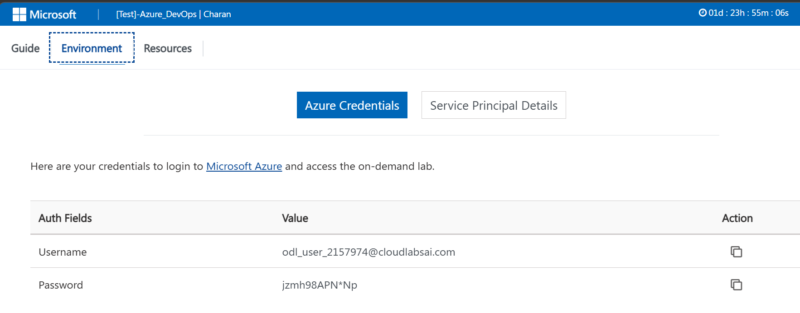

# Task 1: Explore Your Pre-Provisioned Resource Group

**Difficulty:** Beginner  
**Estimated Time:** 15–20 Minutes  
**Type:** Read Only (No changes will be made)

---

##  Objective

In this task, you will log in to the Azure Portal for the first time and explore the Resource Group that has already been set up for you. You will learn what a Resource Group is, what it contains, and how tags are used in Azure.

---

##  Pre-Requisites

Before starting this task, make sure you have the following ready from your **Lab Details Page**:

| Item | Where to Find It |
|---|---|
| Azure Portal Login URL | Lab Details Page |
| Username | Lab Environment Page |
| Password | Lab Environment Page |

---

##  Step-by-Step Instructions

---

### Step 1: Open the Azure Portal

1. Open any web browser on your computer (Chrome, Edge, or Firefox recommended)
2. In the address bar at the top, type the following URL and press **Enter**:

```
https://portal.azure.com
```

3. The Microsoft Azure login page will appear

---


---

### Step 2: Enter Your Username

1. On the login screen, you will see a box that says **"Username"**
2. Type your **Username** exactly as it appears on your Lab Environment Page
3. Click the **Next** button

---

### Step 3: Enter Your Password

1. A new screen will appear asking for your **Password**
2. Type your **Password** exactly as shown on your Lab Environments Page
3. Click the **Sign in** button

---



---

### Step 4: Handle the "Stay Signed In?" Prompt

1. After signing in, a pop-up may appear asking **"Stay signed in?"**
2. Click **No** (recommended for lab environments)
3. You will now be taken to the **Azure Portal Home Page**

---

### Step 5: Recognize the Azure Portal Home Page

1. You should now see the **Azure Home Page**
2. You will see icons/tiles for services like Virtual Machines, Storage Accounts, Resource Groups, etc.
3. At the top, you will see a **Search Bar** — this is the main way to navigate Azure
4. On the left side, there is a **sidebar menu** with quick links

---


---

### Step 6: Navigate to Resource Groups

1. Click on the **Search Bar** at the very top of the page (it says *"Search resources, services, and docs"*)
2. Type: `Resource Groups`
3. In the dropdown results that appear, click on **Resource Groups** (it will have a blue folder icon)

---


---

### Step 7: Find Your Assigned Resource Group

1. The **Resource Groups** page will open showing a list of resource groups
2. Look through the list and find your resource group name from your Lab Details Page
   - Example: `ODL-azure-Contoso-2157974`
3. Click on your **Resource Group name** to open it

>  **Note:** You may see only two resource group in the list — that one is yours and other is related to network minitoring. Do not click on any other resource group if multiple are visible.

---


---

### Step 8: Access the VM through the terminal

1. on the search bar type for the virtual machines.


2. Open the virtual machine resource and open the virtual machine that is present.


3. In the overview page look for the DNS name and copy the DNS name along with that copy the username as well from the environment tab from the cloudlabs lab page.


4. Now Try to use terminal to enter into Virtual machine using below command.
``` bash
ssh <username>@<DNSName>
```

5. Try to replace username with the user name provided in environment page. And similarly replace  the DNS name with the name that you copied from overview page of the VM.
---

### Step 9: Go Back to Overview

1. Click on **Overview** in the left menu to go back to the main Resource Group page
2. At the top of the page, click on your **Subscription name** (it appears as a clickable link)
3. This will open the Subscription page — you can see this is the higher-level container above your Resource Group

> 💡 **What this means:** The hierarchy in Azure is: **Tenant → Subscription → Resource Group → Resources**. Your Resource Group sits inside a Subscription, which is the billing and access boundary.


---

### Step 12: Navigate Back to Your Resource Group

1. Click the **Back button** in your browser, OR
2. Click **Resource Groups** in the breadcrumb trail at the top of the page
3. Click your Resource Group name again to return to it

---


## Task Completion Checklist

Before marking this task as complete, confirm you have done all of the following:

```
□ Successfully logged in to the Azure Portal
□ Navigated to Resource Groups using the search bar
□ Found and opened your assigned Resource Group
□ Noted the Subscription name, Region, and resource count
□ Identified the Linux VM and its supporting resources in the list
□ Opened the Tags section and read the assigned tags
□ Understood the Azure hierarchy (Tenant → Subscription → RG → Resources)
```

---